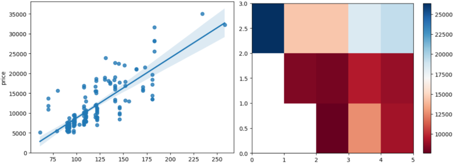

This project demonstrates data preprocessing and analysis techniques to prepare a raw dataset for advanced modeling and research. It highlights the technical and analytical skills to ensure data quality before applying machine learning or deep learning methods.

**About the Project**

- Data Cleaning: Identifying inconsistencies, handling missing values, correcting errors, and improving reliability.

- Exploratory Data Analysis (EDA): Summarizing and visualizing data distributions to uncover patterns, trends, and correlations

**Objectives**

- The goal of this repository is to showcase a structured approach to data preparation, emphasizing clarity, reproducibility, and analytical reasoning.

**Key Techniques**

- Missing value imputation and outlier handling

- Data normalization and formatting

- Feature binning and transformation

- Visual analysis using descriptive statistics and plots

**Dataset**

https://archive.ics.uci.edu/ml/machine-learning-databases/autos/imports-85.data 
